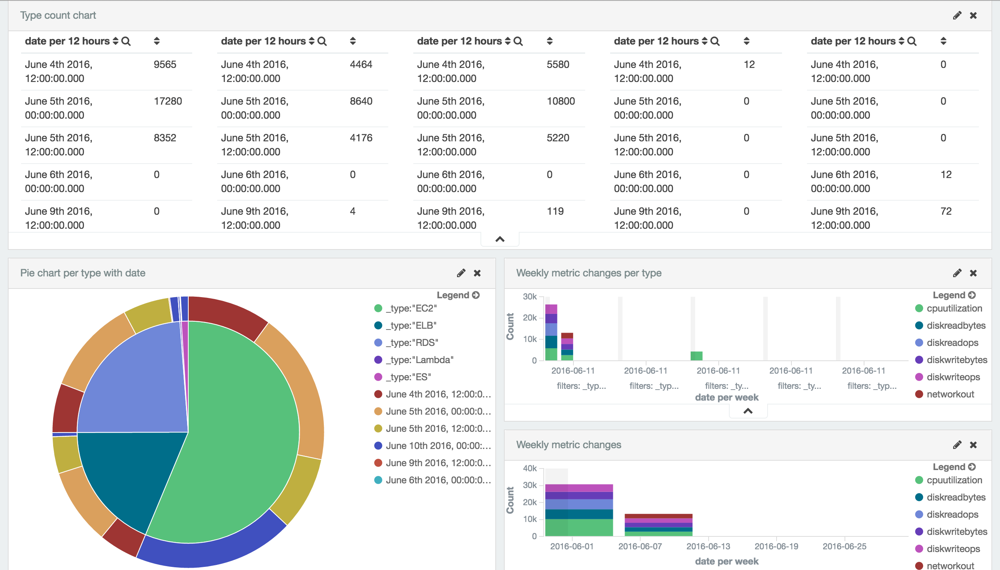

#Sauron: The Severless Dashboard for tagged AWS resource groups
Sauron is the serverless open source dashboard of monitoring for tagged groups of AWS resources. You can watch your server groups as like web, databases and api instances tagged. System metrics for monitoring are gathered by AWS Lambda functions via Amazon Cloudwatch and it delievers to Amazon Elasticsearch services(ES). This dashboard is based on a Node JS application to show metrics via Elasticsearch APIs from Amazon ES.

#### Dashboard 1

#### Dashboard 2

##Why it needs?
If you want to monitor each server stacks as like web servers, application servers and database servers, you have to make new dashboard with associated instances via low level APIs of Amazon CloudWatch. It offers serverless simple dashboard only using AWS managed services including Amazon CloudWatch, AWS Lambda and Amazon ES.

##Architecture

* Collect: AWS Lambda gets CloudWatch metrics periodically using cron features in every 5 miniutes. The dashboard is now supporting some metrics of EC2 instances, Amazon RDS instances and Elastic Load Balancing. It will be increased supported AWS services soon.
 * Elastic Load Balancing: HealthyHostCount, UnHealthyHostCount, RequestCount, Latency
 * EC2: CPUUtilization, DiskReadBytes, DiskReadOps, DiskWriteBytes, DiskWriteOps, NetworkIn, NetworkOut
 * RDS: CPUUtilization, FreeableMemory, ReadThroughput, WriteThroughput, SwapUsage
 * Lambda: Invocations, Errors, Duration, Throttles
 * ES: Nodes, ReadLatency, WriteLatency, FreeStorageSpace
* Analyze: The metrics are stored in Amazon Elasticserch services.
* Visualize: The dashboard of Sauron is supported by Kibana and you can experience fancy dashboard.

## Installation

1. cloning our repo.
    ~~~ sh
    $ git clone https://github.com/cloudtrack/sauron.git
    ~~~

2. bundle install.
    ~~~ sh
    $ bundle install
    ~~~

3. fill in config.yml.
    ~~~ sh
    $ vim config.yml
    ~~~

4. move to installer and run sauron_installer.rb
    ~~~ sh
    $ cd installer && ruby sauron_installer.rb
    ~~~

5. (optional) move to tester and run sauron_tester
    ~~~ sh
    $ cd tester && ruby sauron_tester.rb
    ~~~

## Project information
This project was from one of projects in Seoul National University's 2015 fall - 2016 spring course 'Creative Integrated Design 1'. Currently this project is maintained by Sauron team. Any one can use this source freely, as long as one does not violate the below open source license.

## License
Licensed under the Apache License, Version 2.0 (the "License");
you may not use this file except in compliance with the License.
You may obtain a copy of the License at

    http://www.apache.org/licenses/LICENSE-2.0

Unless required by applicable law or agreed to in writing, software
distributed under the License is distributed on an "AS IS" BASIS,
WITHOUT WARRANTIES OR CONDITIONS OF ANY KIND, either express or implied.
See the License for the specific language governing permissions and
limitations under the License.
